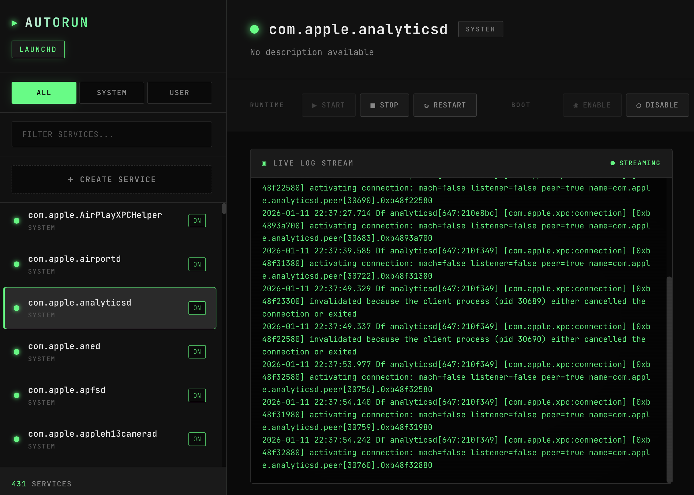

# autorun

A graphical interface for managing your operating system's built-in process manager. No third-party process managers required.



## What is autorun?

autorun is a lightweight web-based service manager that provides a clean UI for controlling system services. It works directly with your OS's native service management:

- **macOS**: launchd (launchctl)
- **Linux**: systemd (systemctl)

Instead of memorizing arcane command-line incantations or installing heavyweight process managers like pm2, supervisor, or forever, autorun gives you a visual interface to the service infrastructure your OS already provides.

## Why use autorun?

**Use your OS's built-in tools.** Your operating system already has a robust, battle-tested service manager. launchd and systemd handle process supervision, automatic restarts, logging, and boot-time startup. autorun simply makes these capabilities accessible through a modern UI.

**Single static binary.** autorun compiles to a single executable with no external dependencies. The web interface is embedded directly in the binary. Drop it anywhere and run it.

**Works on headless servers.** Since autorun serves a web UI, you can manage services on remote machines through your browser. SSH in, start autorun, and access it from your local machine via port forwarding or network access.

**No daemon required.** autorun doesn't run in the background or install itself as a service. Start it when you need it, stop it when you're done.

## Features

- List all user and system services
- Start, stop, and restart services
- Enable/disable services for boot
- Live log streaming via WebSocket
- Create new services through the UI
- Delete services you've created
- Filter and search services
- Cross-platform (macOS and Linux)

## Installation

### From source

```bash
git clone https://github.com/yourusername/autorun.git
cd autorun
go build -o autorun .
```

### Binary releases

Download the latest release for your platform from the releases page.

## Usage

```bash
# Start with defaults (localhost:8080)
./autorun

# Custom port
./autorun -port 3000

# Listen on all interfaces (see security warning below)
./autorun -listen 0.0.0.0
```

Then open http://localhost:8080 in your browser.

### Remote access

For headless servers, you have a few options:

**SSH port forwarding (recommended):**
```bash
ssh -L 8080:localhost:8080 yourserver
# Then run autorun on the server and access http://localhost:8080 locally
```

**Direct network access:**
```bash
./autorun -listen 0.0.0.0
# Access via http://yourserver:8080
```

## Security

autorun has no authentication. By default, it only listens on localhost (127.0.0.1).

If you bind to a non-localhost address with `-listen`, anyone who can reach that address can:
- View all system and user services
- Start, stop, and restart services
- Enable and disable services
- View service logs
- Create and delete services

Only expose autorun to networks you trust, or use SSH tunneling for remote access.

## How it works

autorun is a Go application that:

1. Detects your platform (launchd on macOS, systemd on Linux)
2. Starts an HTTP server with a REST API and WebSocket endpoint
3. Serves an embedded web interface
4. Translates API calls to native service manager commands

The frontend is plain HTML, CSS, and JavaScript with no build step. It's embedded into the binary at compile time using Go's `embed` package.

### API

| Endpoint | Description |
|----------|-------------|
| `GET /api/platform` | Returns current platform |
| `GET /api/services?scope=user\|system\|all` | List services |
| `GET /api/services/{name}?scope=...` | Get service details |
| `POST /api/services/{name}/start?scope=...` | Start service |
| `POST /api/services/{name}/stop?scope=...` | Stop service |
| `POST /api/services/{name}/restart?scope=...` | Restart service |
| `POST /api/services/{name}/enable?scope=...` | Enable at boot |
| `POST /api/services/{name}/disable?scope=...` | Disable at boot |
| `POST /api/services` | Create new service |
| `DELETE /api/services/{name}?scope=...` | Delete service |
| `WS /api/services/{name}/logs?scope=...` | Stream logs |

## License

MIT
